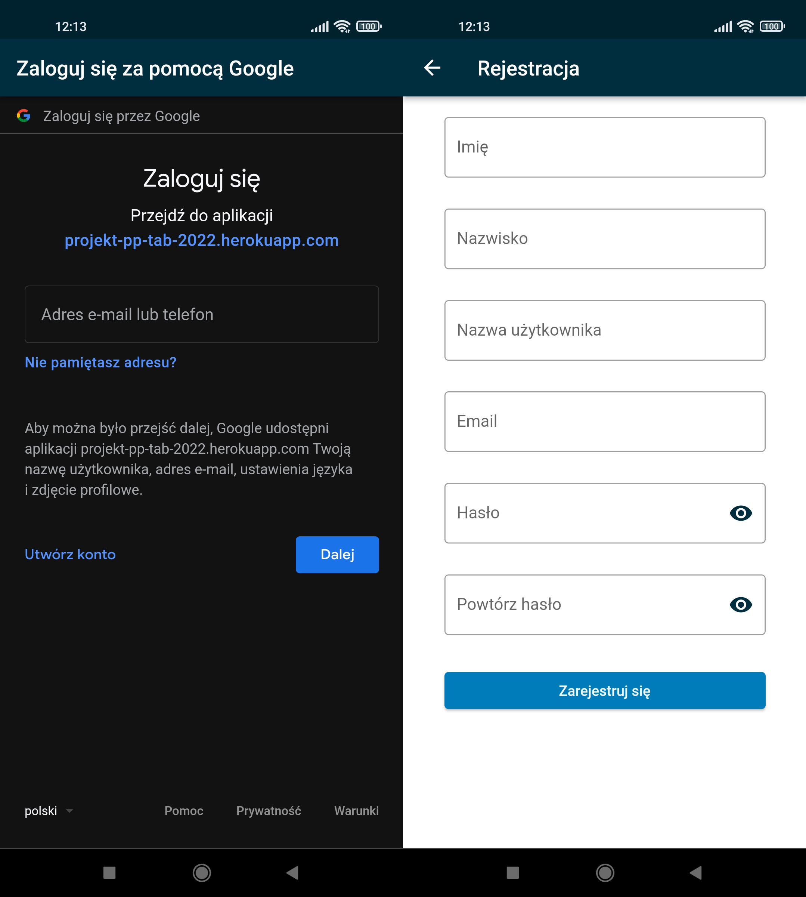

<h1>SkiSlope-mobileApp</h1>
Application prepared in flutter as a credit project in engineering studies. Its purpose is to handle tickets at a ski station. The user downloads his list of tickets (using the API) and displays the corresponding QR code to open the entrance gate to the slope.
<h2>App presentation</h2>

<h2>Google login and registration form</h2>
